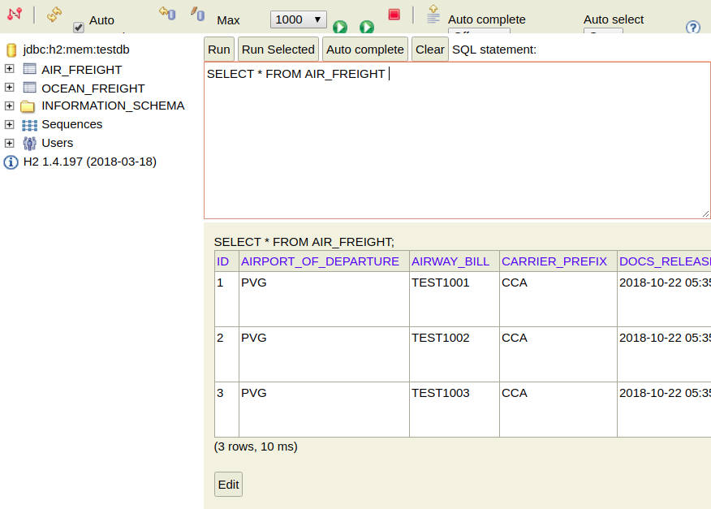

# Panalpina Build-a-Backend Challenge

## Requirements
 - Java SDK 1.8
 - Maven 3.3.9

The developed source code uses maven for dependency management and build execution. For ease of use you may want to ensure that 'mvn' is available on your PATH.

## Executing the submission

To execute the code:

      $cd submission/code
      
      $mvn clean install

      $cd restapi/
      
      $mvn spring-boot:run

## Workflow

The developed code reads csv files located in src/main/resources folder and loads data into JPA repositories. The H2 in-memory database has been used for the scope of this challenge. The application.properties file located in src/main/resources folder allow to configure it for another database by properties:

      spring.datasource.url=jdbc:h2:mem:testdb
      spring.datasource.driverClassName=org.h2.Driver
      spring.datasource.username=sa
      spring.datasource.password=

## MarineTraffic Keys
 
Specify your key in application.properties as the values of following properties:
 
     marinetraffic.vessel.historical.track.PS01.key=<YOUR_KEY>
     marinetraffic.single.vessel.position.PS07.key=<YOUR_KEY>
     marinetraffic.voyage.forecasts.VI01.key=<YOUR_KEY>
     marinetraffic.search.vessel.VD03.key=<YOUR_KEY>

## Points to note

- The swagger document has been updated for FlightShipmentResponse and FreightShipmentResponse.
- The data provided by the client in the csv files is not recent. So test files `Air_freight_test.csv` and `Ocean_freight_test.csv` have been created and placed with original data at `src/main/resources` folder. The structure of the files are exactly similar as given by the client but the data value is recent for ships and flights(at the time of writing and testing the code).
- MarineTraffic API needs MMSI for making API calls which is not included in the client data. So the code takes value from property `marinetraffic.api.test.mmsi.value` in application.properties and makes calls.
- Username and password of FlightAware API works for `FlightXML version 3` and NOT for FlightXML 2.0. The two versions are not interchangeable.
- FlightAware API calls uses ICAO airline number but client data has provided IATA airline values in `CARRIER_PREFIX`. `Air_freight_test.csv` uses ICAO airline value in carrier preifx to make flightXML API calls.
- The code allows POST requests but only properties in the csv files given by the client are allowed to be updated. Other properties of FlightShipmentResponse and FrieghtShipmentResponse are not in the database and hence can't be updated.

## H2-console
You can watch the data loaded into database by using H2-console. Type the url `http://localhost:8080/h2-console/` in the browser and specify `jdbc:h2:mem:testdb` as JDBC URL.
 
 

